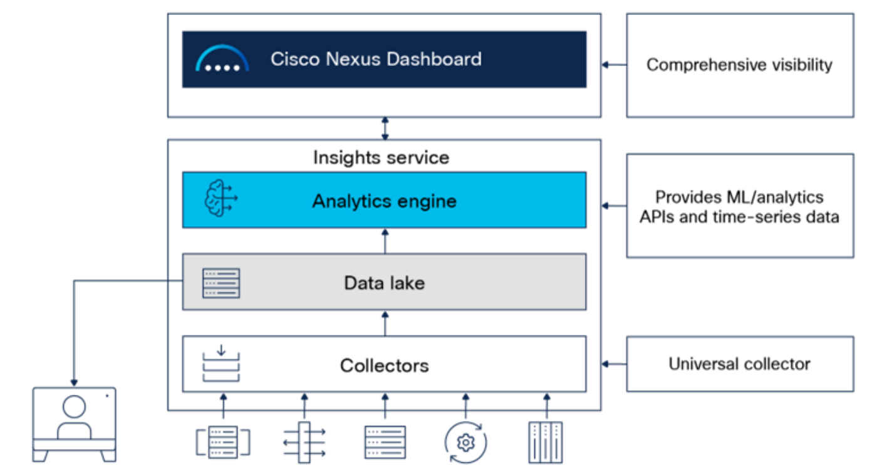

Network infrastructure management is becoming more complex, diverse, and distributed, with multiple configuration points, monitoring tools, and vast amounts of data being generated every second. Cisco Nexus Dashboard software provides a single focal point to unite disparate network configurations and views of multiple switches, data centers, and clouds, and is included with all Cisco Nexus 9000 switch tiered-license purchases. 

Through its **Insights** service, network operators can now accelerate time to resolution and preserve compliance in their networks by leveraging years of Cisco knowledge hosted on Nexus Dashboard’s analytics engine. 

The operational intelligence engine of Cisco Nexus Dashboard Insights incorporates a set of advanced alerting, baselining, correlation, and forecasting algorithms to provide deep insights into the behavior of the network by utilizing telemetry data obtained from networking and compute components.

**What You'll Learn**

In this tutorial, you'll learn:

- What log correlation is and how it improves visibility and root cause detection,
- How to collect logs from multiple network devices in a Nexus-based fabric,
- How to use Cisco Nexus Dashboard Insights (NDI) to visualise and analyze correlated log events,
- How to apply timestamp and pattern matching to identify related issues.
