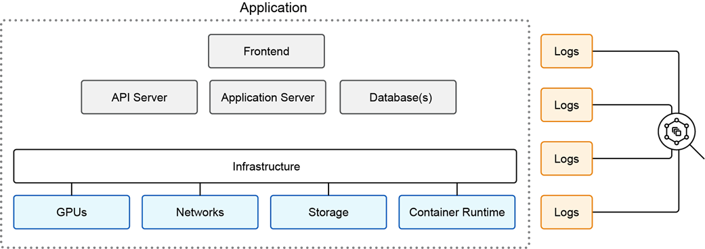

**Log Correlation Overview**

Logs are often the first place to look when something goes wrong. Today's solutions rely on a system of linked components. These components are inference servers, such as Ollama,  databases, APIs, front end UIs, GPUs, storage systems, network devices, containers, and other components. Each of these systems produces its own set of logs.

Log correlation is about **connecting the dots between all these log sources to understand what is really happening**. It helps you reconstruct the timeline of events across different services, identify root causes, and debug performance bottlenecks.

**What Is a Log?**

Think of a log as a digital journal entry written by your system. Every time something happens—such as a user sending a prompt, a model generating tokens, or an error occurring in your application—a log entry records it. Logs can include timestamps, log severity levels, status codes, messages, and more. 
 
**What Is Log Correlation?**

Log correlation involves identifying relationships between events from different log sources. For example, matching access and error logs can reveal issues during a specific user session in an app.

Think of a user making a request to your app. That one request may trigger:
- An API gateway log
- A backend process log
- A request to the database server
- A GPU workload spike
- An error in a downstream database or vector search

Without correlation, you are staring at isolated log entries. With correlation, you are reconstructing a story. When working with any IT system, you encounter a wide range of logs. 
These logs vary in format and purpose. Some focus on security, like access or event logs, while others provide performance and reliability insights, such as error or resource usage logs. Understanding how to use each type helps you monitor your system effectively and respond quickly to issues.

Types of logs you may encounter:
- **Access Logs**: Track every incoming request with details like IP address, timestamp, requested resource, and response code. These help identify traffic patterns and potential security issues, such as sudden spikes from a single IP.

- **Error Logs**: Capture failures like broken database connections or crashes. These logs are key to diagnosing problems and keeping services stable.

- **Event Logs**: Record major system activities, such as logins, reboots, or config changes. Useful for auditing and spotting unauthorized access or system changes.

> You typically only have access to logs from systems you directly manage. For example, when interacting with third-party APIs, you might get a high-level response, but you won’t see detailed backend logs; they remain with the provider.

**Techniques for Log Correlation**

To correlate logs effectively, you are going to rely on key techniques that help align entries from different sources and reconstruct end-to-end behavior:
 
- **Timestamps and request IDs** are essential for linking logs across services. These fields help you identify which logs belong to the same request, making correlation more precise and reliable. Pattern matching helps find connections and infer relationships between different events by looking for repeated or familiar patterns in messages, user input, or known sequences of events.
- **Log analysis tools** can use these fields to automatically group-related log entries from different sources, helping you quickly trace workflows and troubleshoot issues across complex systems.
- **Pattern matching** involves inferring relationships based on similar messages, user input, or known sequences of events.

Most systems also include a log severity level at the beginning of each message, which helps categorize and prioritize log analysis:
- **[INFO]**: Normal operational messages.
- **[WARN]**: Non-critical issues that may need attention.
- **[ERROR]**: Critical problems requiring intervention.
- **[DEBUG]**: Detailed information, usually used by developers.

