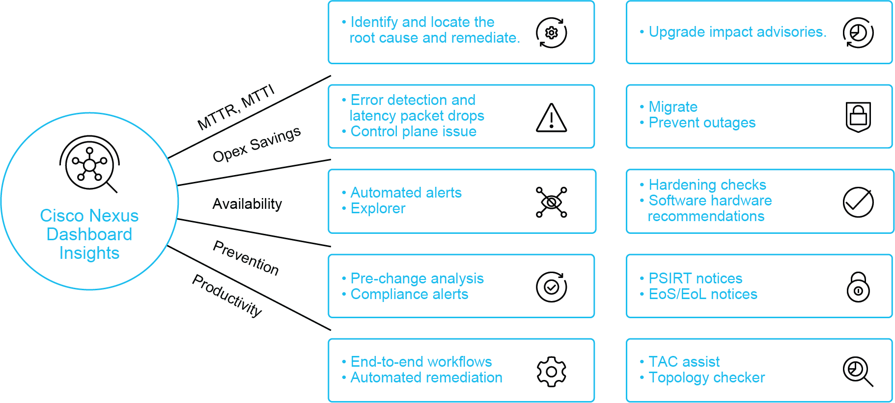
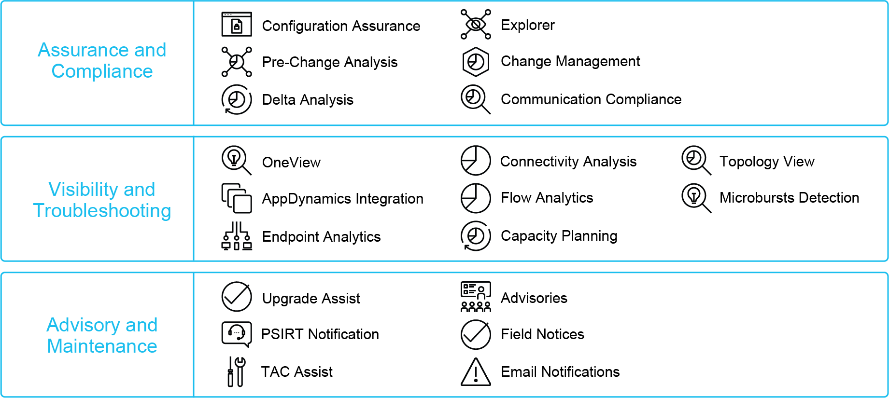
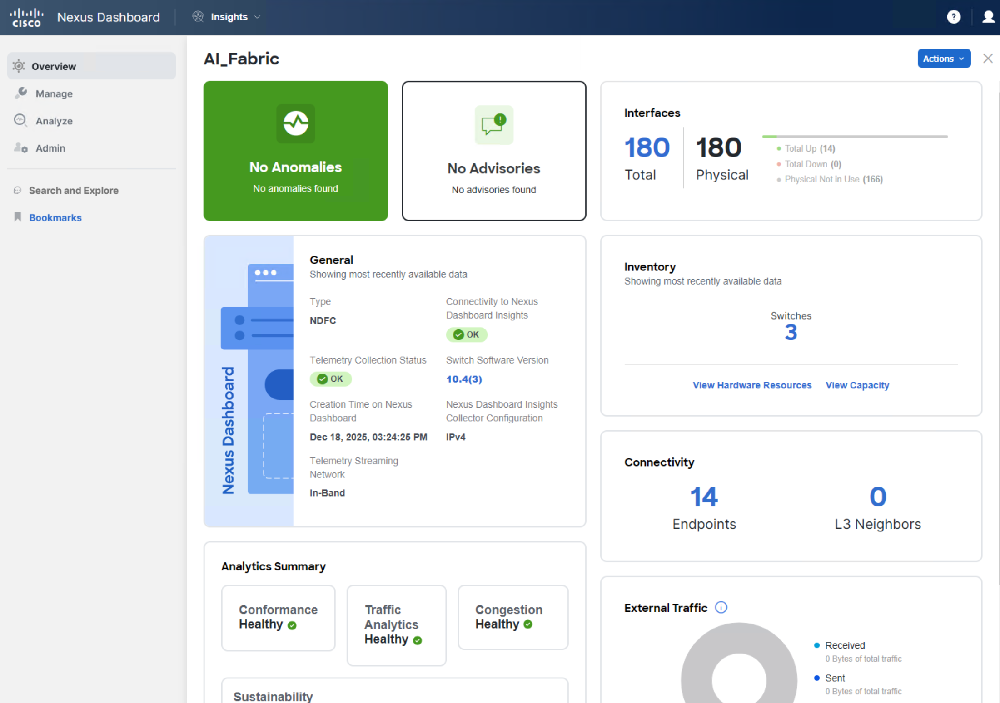

**Cisco Nexus Dashboard Insights** is a comprehensive analytics tool that simplifies and automates:

- Root cause analysis, 
- Troubleshooting,  
- Remediation of network issues. 

With Insights, you also get product security incident response team, or otherwise known as PSIRT, and end of life notices on software versions and equipment that you have in your network, and attack assist to facilitate log collection and working with Terminal Access Controller Access-Control System (TACACS). These functions help you reduce mean time to identify and mean time to repair, save on operational costs, increase network availability, prevent hardware-related issues, and increase the productivity of your IT staff.

Cisco Nexus Dashboard Insights provides quite a few functions that you can use:
- Root cause analysis: Identify, locate, analyze, and remediate the cause of a problem.
- Error and packet drop detection: Identify where packet drops occur and their cause
- Automated alerts and alerts explorer
- Pre-change analysis and compliance alerts: Powerful planning tools
- End-to-end workflows for automated problem remediation
- Advisories on the impact of an upgrade
- Mitigation and prevention of outages
- Device hardening checks and software/hardware recommendations
- Cisco Product Security Incident Response Team (PSIRT) and End-of-Life notices on software versions and equipment in your network
- Cisco Technical Assistance Center (TAC) Assist and Topology Checker

With these functions, Cisco Nexus Dashboard Insights helps you reduce the mean-time-to-identify and mean-time-to-repair, save on operational costs, increase overall availability of your network, prevent hardware-related issues, and increase IT staff productivity.

**Cisco Nexus Dashboard Insights Key Features**

The key features of Cisco Nexus Dashboard Insights can be divided into three main groups.

**Assurance and compliance functions** include configuration assurance, pre-change analysis and delta analysis. These are especially useful as planning tools. Another useful feature is connectivity explorer, which is very intuitive — you can "ask" Cisco Nexus Dashboard Insights to perform a connectivity analysis to check if an endpoint can reach an IP address, or another endpoint, and so on.

**Visibility and troubleshooting tools** include, connectivity analysis, endpoint analytics, flow analytics, and topology view.

**Advisory and maintenance tools** include various PSIRT and pre-upgrade alerts, advisories on software- and hardware-based known issues or hardware types, field notices, email notifications, and TAC assist.

**Cisco Nexus Dashboard Insights Overview Page**

On the Overview page, you are presented with a summary of alerts, an anomaly score, the timeline, and a breakdown of anomalies and advisories. All the elements that you see are clickable, so if you are interested in leaf nodes with a Critical anomaly score, click it to see the affected leaf nodes. This way, you can further drill down into an anomaly.

