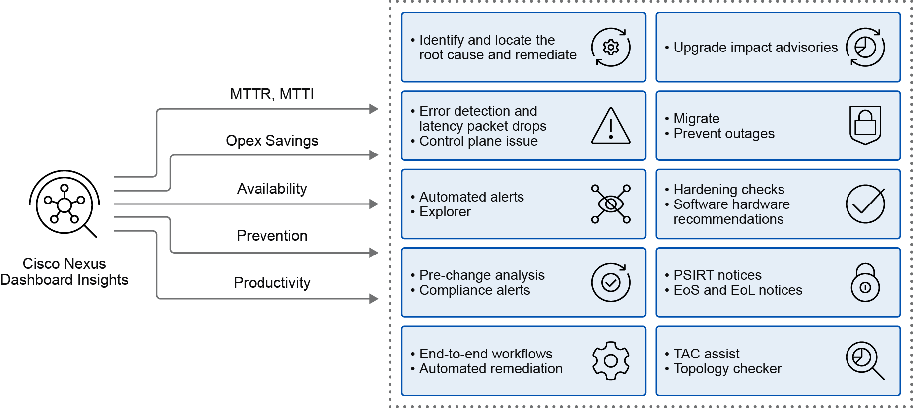
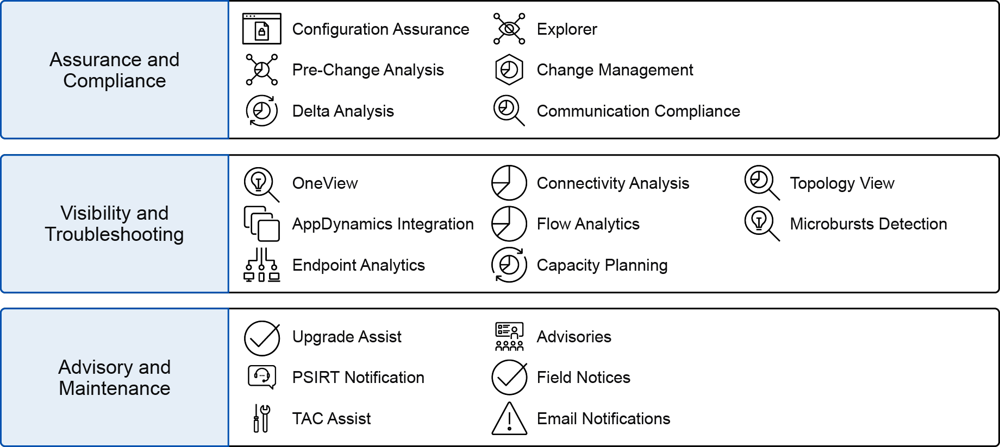
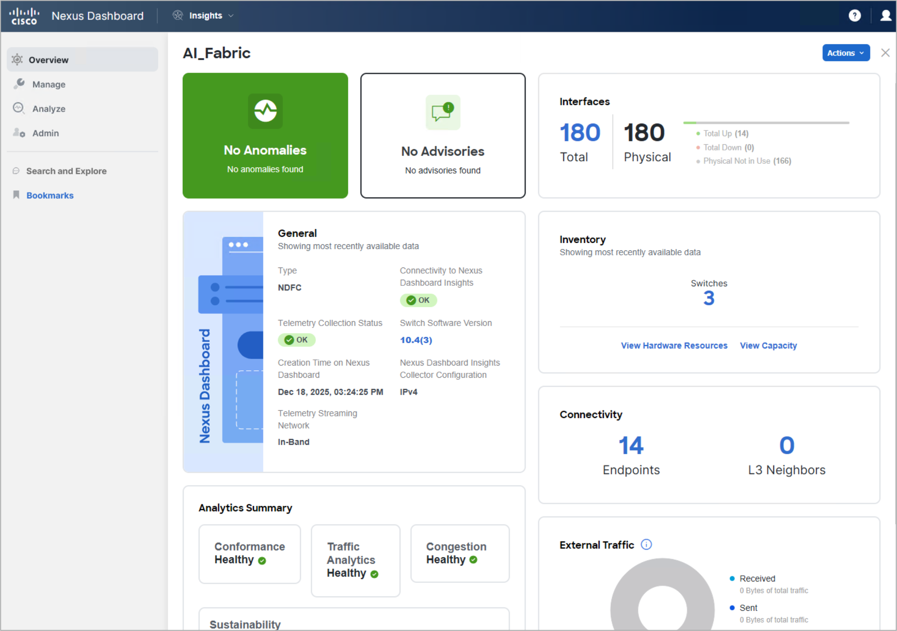

**Cisco Nexus Dashboard Insights** is a comprehensive analytics tool that simplifies and automates:

- Root cause analysis
- Troubleshooting
- Remediation of network issues

With Cisco Nexus Dashboard Insights, you also receive Cisco Product Security Incident Response Team (PSIRT) notifications, end-of-life notices for software versions and equipment in your network, and Attack Assist to facilitate log collection and collaboration with the Terminal Access Controller Access-Control System (TACACS). These functions help you reduce mean time to identify and mean time to repair, save on operational costs, increase network availability, prevent hardware-related issues, and increase the productivity of your IT staff.

Cisco Nexus Dashboard Insights offers a comprehensive set of functions designed to enhance network operations and management. Key features include:

- Root cause analysis: Identify, locate, analyze, and remediate the cause of a problem.
- Error and packet drop detection: Identify where packet drops occur and their cause
- Automated alerts and alerts explorer
- Pre-change analysis and compliance alerts: Powerful planning tools
- End-to-end workflows for automated problem remediation
- Advisories on the impact of an upgrade
- Mitigation and prevention of outages
- Device hardening checks and software and hardware recommendations
- Cisco PSIRT and end-of-life notices on software versions and equipment in your network
- Cisco Technical Assistance Center (TAC) Assist and Topology Checker

These capabilities help you reduce mean time to identify (MTTI) and mean time to repair (MTTR), lower operational costs, increase overall network availability, prevent hardware-related issues, and boost IT staff productivity.

**Cisco Nexus Dashboard Insights Key Features**

The key features of Cisco Nexus Dashboard Insights are grouped into three main categories:

**Assurance and compliance functions** include configuration assurance, pre-change analysis and delta analysis. These are especially useful as planning tools. Another useful feature is connectivity explorer, which enables you to "ask" Cisco Nexus Dashboard Insights to perform a connectivity analysis to check if an endpoint can reach an IP address, or another endpoint, and so on.

**Visibility and troubleshooting tools** include connectivity analysis, endpoint analytics, flow analytics, and topology view.

**Advisory and maintenance tools** include various Cisco PSIRT and pre-upgrade alerts, advisories on software- and hardware-based known issues or hardware types, field notices, email notifications, and TAC assist.

**Cisco Nexus Dashboard Insights Overview Page**

The Overview page presents a summary of alerts, an anomaly score, a timeline, and a breakdown of anomalies and advisories. All elements are clickable; for example, if you are interested in leaf nodes with a Critical anomaly score, you can click to see the affected leaf nodes. This allows you to drill down further into an anomaly for detailed investigation.

