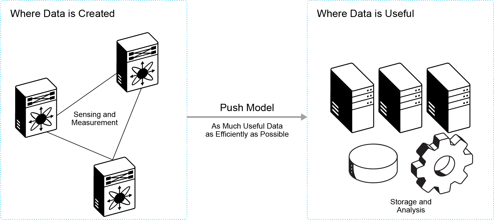
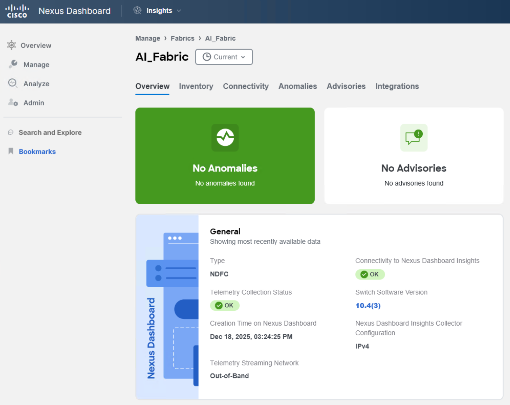
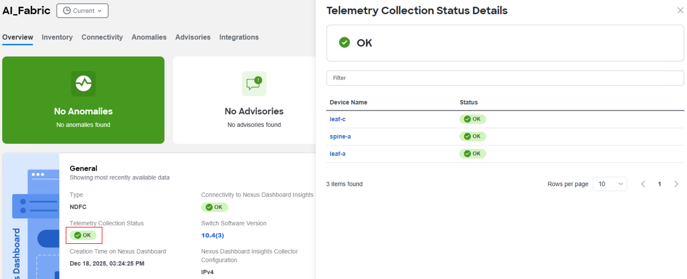
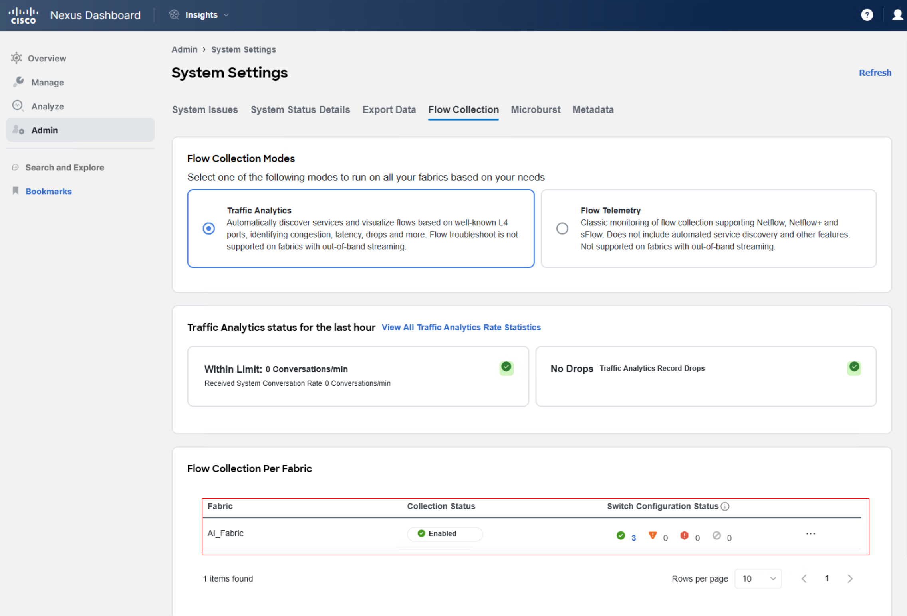

**Data collection for analysis and troubleshooting** is crucial in monitoring the health of a network. Several mechanisms, including Simple Network Management Protocol (SNMP), CLI, and syslog, are available for collecting network data. Yet, these mechanisms have limitations that hinder automation and scalability.

**The pull model**, an older mechanism for collecting data from a network, has its limitations. In this model, the client initiates the request for data from network elements. However, when there is more than one network management station (NMS) in the network, the pull model does not scale. 

On the other hand, **the push model** continuously streams data out of the network and notifies the client. This model is enabled by telemetry, which provides near-real-time access to monitoring data. The data can be retrieved either periodically (frequency-based) or only when a change occurs in any object on a specified path (event-based).

**Fabrics**

Nexus Dashboard Insights processes and analyzes telemetry data continuously streamed from all the devices in the fabric.

Fabrics are on-premises network regions that consist of a group of switches and other networking devices that provide connectivity for your applications and endpoints. You can split fabrics into different availability zones, such as pods, that are analyzed and managed by Nexus Dashboard Insights.

Types of on-premises fabrics:
- **Online fabrics**: Multiple Nexus switches running Cisco Application Centric Infrastructure (ACI) or Nexus OS (NX-OS) that can be represented by a controller such as Cisco Cisco Application Policy Infrastructure Controller (APIC) or Cisco Nexus Dashboard Fabric Controller (NDFC) and connected to Nexus Dashboard Insights to continuously stream telemetry. Types of online fabrics include:

    - **ACI**: Multiple Nexus switches with Cisco ACI and represented by a Cisco APIC.

    - **NDFC**: Multiple Nexus switches with Cisco NX-OS and represented by Cisco NDFC.

    - **NX-OS**: A group of Cisco Nexus 9000 switches running NX-OS without a controller.

- **Snapshot fabrics**: Controller-based fabrics, that are referenced by a snapshot, for use in one-time analysis or demonstrations. They may or may not be connected to Nexus Dashboard Insights over the network.

**Verify and Enable Telemetry Collection**

Once your fabric is onboarded and fully prepared, Nexus Dashboard Insights will start the fabric analysis to collect data from your fabric and display the fabric information in the Fabrics page. From there, you can view your fabric’s general information, inventory, L2 and L3 connectivity, endpoints, anomalies and advisories and more!

To verify the telemetry collection status, navigate to your fabric overview using **Manage > Fabrics > (Fabric Name)**. 

> **Note**: In this example, the name of the fabric is **AI_Fabric**.

Telemetry collection status provides insights into the health and performance of the switches and devices in your network. The different telemetry collection statuses at the fabric level include:
- **OK** - This status indicates that the telemetry data streaming from all the switches to Nexus Dashboard Insights is functioning correctly. This is the desired state, as it ensures comprehensive monitoring and visibility into the network’s performance.
- **Not OK** - This status indicates the telemetry data streaming from all the switches to Nexus Dashboard Insights is not functioning correctly. This could be as a result of various problems such as network outages, misconfigurations, or hardware failures.
- **Partial OK** - This status indicates that telemetry data streaming from all the switches to Nexus Dashboard Insights is not functioning correctly from some of the switches but it is functioning correctly from others. This suggests an inconsistent or partial telemetry data flow within the network which could be caused by various factors, such as switch-specific issues or misconfigurations on some switches.

You can check invidual node by clicking of the Telemetry Collection Status, and more detailed information will open on the right side of the window.

In case the telemetry is not yet configured, you can configure it by navigating to **Flow Collection** settings using **Admin > System Settings > Flow Collection**. Select your fabric by clicking on three dots and select **Enable**.

This action will push telemetry configuration to your devices using the fabric controller.

> **Note**: If you already enabled feature analytics on the switches, the configuration from Nexus Dashboard Insights will fail because you cannot enable feature netflow when feature analytics is enabled. Nexus Dashboard Insights raises a system anomaly that contains the following string: *Delivery failed with message: Netflow feature cannot be enabled while analytics feature is enabled.* Delete the the Flow Telemetry feature configurations from the switches and then push Traffic Analytics configuration from Nexus Dashboard Insights again.

