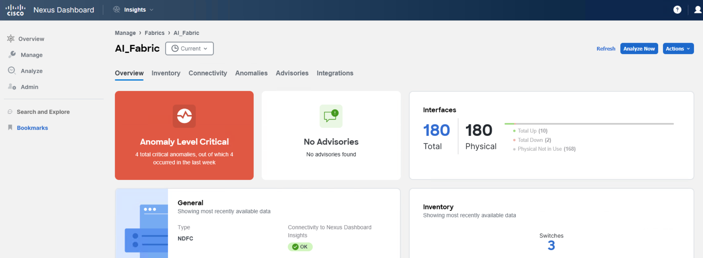
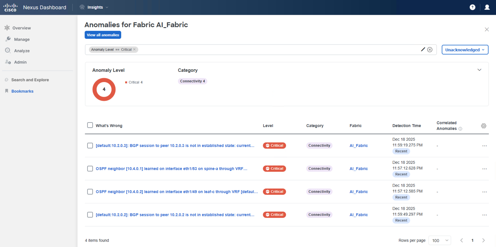
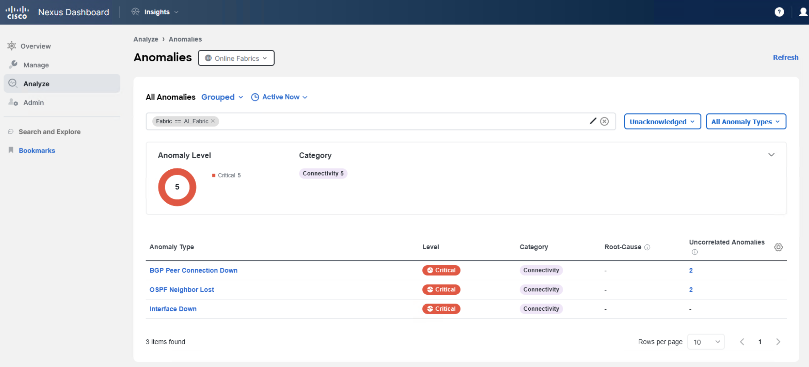
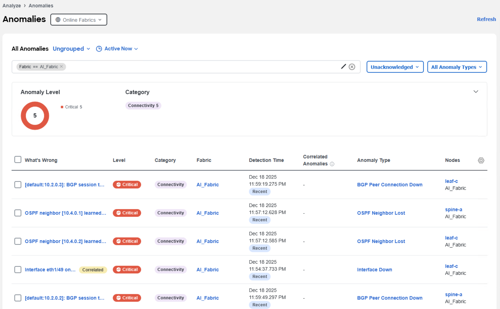

In this step, you will review a simulated network fault on an interface and explore correlation visualizations.

Navigate to your fabric overview using **Manage > Fabric > (Fabric Name)**:

> **Note**: In this example, the name of the fabric is **AI_Fabric**.

Click on the anomalies. This action will open a more detailed view:

Now select **View all anomalies**. This action will open an **Analyze > Anomalies** detailed view.

By default, all currently active anomalies are shown. From the filter, select the views **Unacknowledged** and **All Anomaly Types**. From the list, you can see that three records exist. Review the anomalies by ungrouping and reviewing them individually. Pay attention to the filter view (Unacknowledged, All anomaly types).

For example, let's review the **Interface down** issue on the node **leaf-c** (Interface eth1/49 is down).

It seems there is an interface issue impacting the connectivity between nodes **leaf-c** and **spine-a**, based on the topology of the fabric. This event is correlated with other events:
- interface **Eth1/53** admin status change on the **spine-a** to administratively down, a root cause ot this event
- Link Layer Discovery Protocol (LLDP) link flap, a consequence of interface shutdowns 

Based on the available data, this was an intermittent issue since the issue has just been cleared. But was it really? We can verify that by using message patterns and timestamp.
