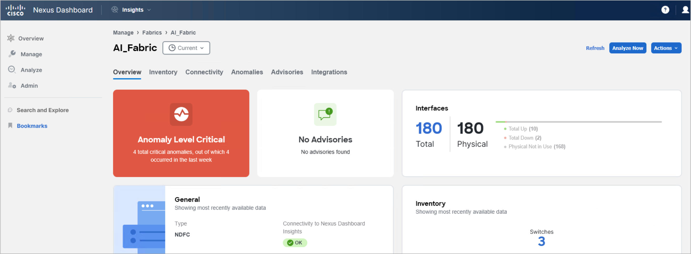
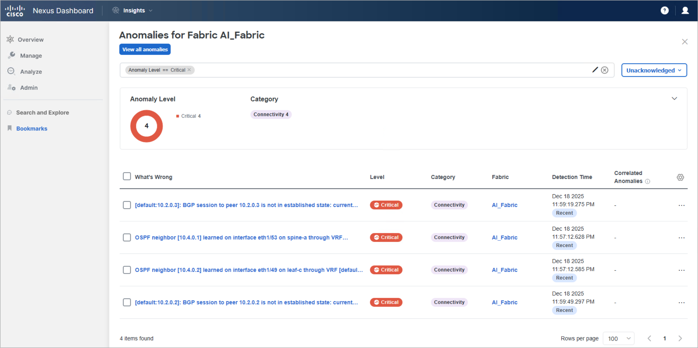
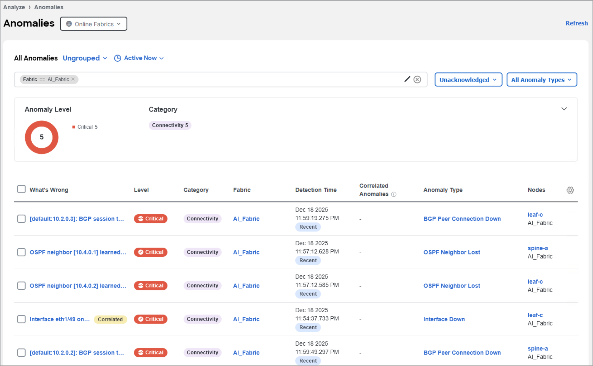
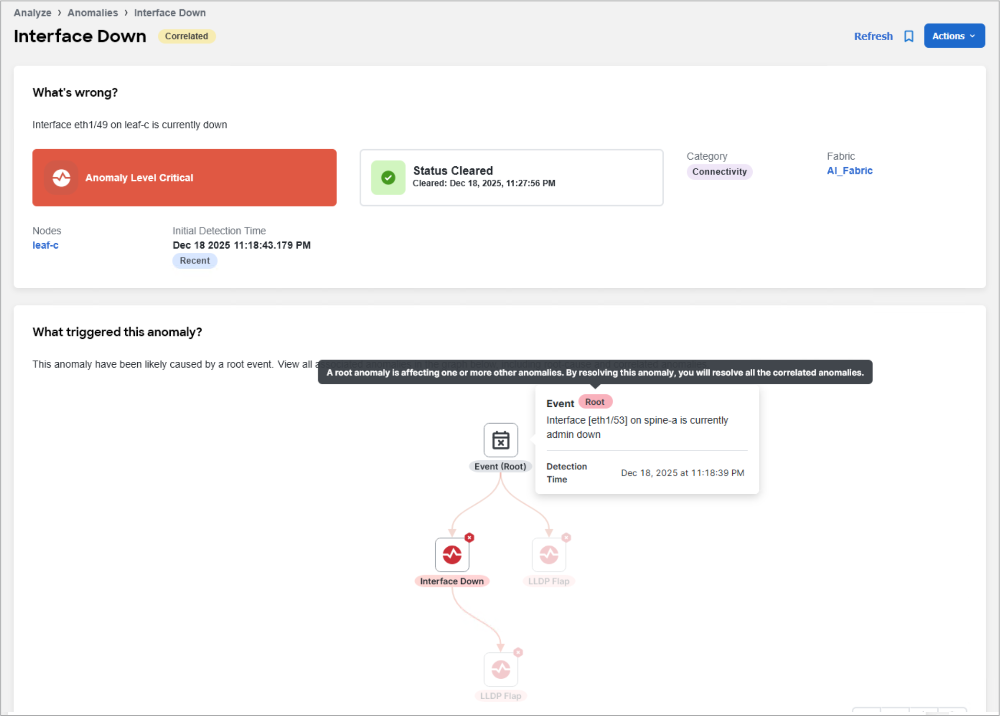

In this step, you will review a simulated network fault on an interface and explore correlation visualizations.

Navigate to your fabric overview cy selecting **Manage** > **Fabric** > **(Fabric Name)**:

> In this example, the name of the fabric is **AI_Fabric**.

Click on the anomalies to open a more detailed view:

Next, select **View all anomalies**. This action will open an **Analyze** > **Anomalies** detailed view.

By default, all currently active anomalies are displayed. Use the filter and select the **Unacknowledged** and **All Anomaly Types** views. You can see that five such records exist. Review the anomalies by ungrouping and reviewing them individually. Pay attention to the filter view (Unacknowledged and All anomaly types).

For example, let's review the **Interface down** issue on the node **leaf-c** (interface Eth1/49 is down).

It seems there is an interface issue impacting the connectivity between nodes **leaf-c** and **spine-a** (based on the topology of the fabric). This event is correlated with other events:

- Interface **Eth1/53** admin status changed on the **spine-a** node to administratively down, which is identified as the root cause of the issue.
- Link Layer Discovery Protocol (LLDP) link flap, which is a consequence of the interface shutdowns.

Based on the available data, this was an intermittent issue, as it has just been cleared. But was it truly resolved? We can verify this by analyzing message patterns and timestamps.
