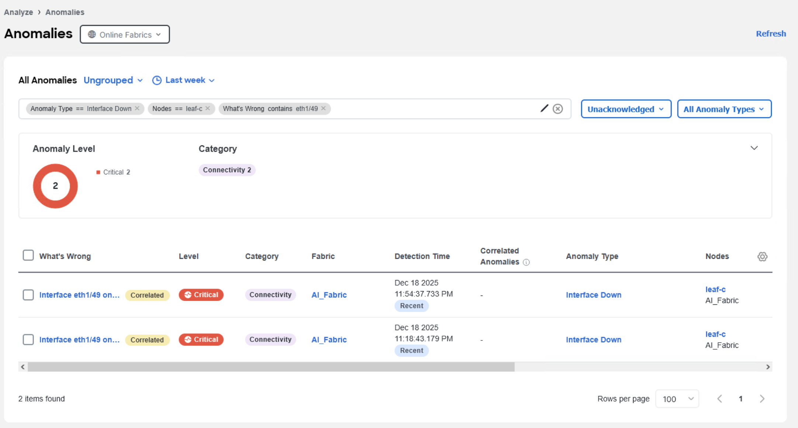
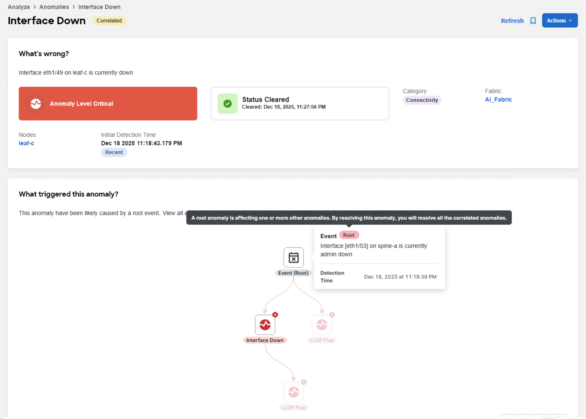

We can now inspect the anomaly logs and see whether event identified in the previous step, occurred multiple times in the last week. The anomaly appeared on the device **leaf-c** on interface **Ethernet1/49**. 

**Setting Up the Filter**

You can filter out such events in the **Analyze > Anomalies** view.

The filter for the search criteria above is the following:
- All anomalies: **Ungrouped**, **Unacknowledged**, and **All Anomaly Types** filter is set,
- Time frame:  **Last week**,
- Anomaly type: **Interface down**,
- Nodes: **leaf-c**,
- What's wrong: contains the interface name **eth1/49**.

**Results of the Search**

The search yields two records. By exploring each individual records, you can determine the root cause of the recurring anomalies, and in both cases, it seems the **root** cause is a shutdown of the interface **eth1/53** on the **spine-a** device.

